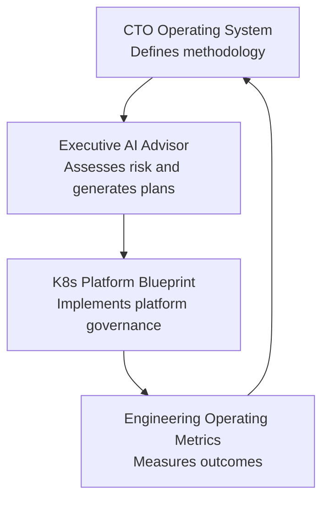

# Technology Leadership Portfolio

A practical system for assessing, operating, governing, and improving technology organizations.

## Executive Summary

This portfolio demonstrates an integrated operating model for CTOs, PE operating partners, boards, investors, and technology leaders. The projects connect methodology, document-driven assessment, platform execution, and engineering measurement into one practical system for technology leadership.

The portfolio covers:

- technology diligence
- AI governance
- platform modernization
- Kubernetes governance
- engineering operating metrics
- 100-day planning
- board-level reporting

The narrative is not "engineer who built tools." It is a technology executive operating system for diligence, governance, platform execution, and measurable improvement.

## Operating Model

## Portfolio Projects

| Project | Role in the System | Repository |
|---|---|---|
| CTO Operating System | Defines the methodology, frameworks, playbooks, governance models, board reporting templates, diligence frameworks, and operating cadences. | [cto-operating-system](https://github.com/serewicz/cto-operating-system) |
| Executive AI Advisor | Analyzes company documents and generates diligence reports, board briefs, AI governance assessments, CRA readiness assessments, and 100-day technology plans. | [Executive-AI-Advisor](https://github.com/serewicz/Executive-AI-Advisor) |
| K8s Platform Blueprint | Provides implementation patterns for Kubernetes governance, FinOps, observability, policy-as-code, compliance evidence, and platform operations. | [k8s-platform-blueprint](https://github.com/serewicz/k8s-platform-blueprint) |
| Engineering Operating Metrics | Measures engineering delivery flow, review quality, rework, cost, risk, AI usage, and governance. | [engineering-operating-metrics](https://github.com/serewicz/engineering-operating-metrics) |

## How the System Works

### 1. Define the Methodology

CTO Operating System contains the advisory frameworks: technology diligence, AI governance, risk scoring, board reporting, 100-day planning, engineering organization review, and operating cadences.

### 2. Assess the Organization

Executive AI Advisor automates portions of the methodology by ingesting company documents, retrieving cited evidence, and producing executive outputs such as diligence reports, board briefs, CRA readiness assessments, and 100-day technology plans.

### 3. Implement Platform Controls

K8s Platform Blueprint shows how platform governance can be implemented through Kubernetes controls, FinOps visibility, policy-as-code, observability, compliance evidence, and executive dashboard patterns.

### 4. Measure Outcomes

Engineering Operating Metrics tracks whether operating changes are improving delivery flow, review quality, rework, engineering cost, AI usage cost, technical risk, and governance.

## Executive Use Cases

### Technology Due Diligence

Use the methodology to assess architecture, security, technical debt, AI readiness, platform maturity, key-person risk, engineering organization health, and operational risk.

### Post-Close or Growth Equity Planning

Use Executive AI Advisor and CTO Operating System to convert findings into a 100-day technology plan with owners, priorities, citations, board checkpoints, and success metrics.

### Platform Modernization

Use K8s Platform Blueprint to translate platform findings into practical Kubernetes governance, cost, security, observability, and compliance controls.

### Engineering Operating Cadence

Use Engineering Operating Metrics to track whether the organization is improving flow, quality, cost discipline, and risk management over time.

## Board-Level Framing

This portfolio is designed to answer executive questions:

- What technology risks matter to the business?
- What evidence supports those risks?
- What should management do in the first 100 days?
- Which platform controls reduce operational and compliance risk?
- Are engineering outcomes improving after intervention?
- How should technology leadership communicate progress to the board?

## Positioning

These projects demonstrate a practical CTO operating model:

- assess technology risk with evidence
- govern AI and platform decisions
- modernize infrastructure with clear controls
- translate diligence into action
- measure engineering outcomes
- communicate technology issues as business issues

Technology leadership is most effective when ownership, tradeoffs, risk, controls, and outcomes are explicit.
