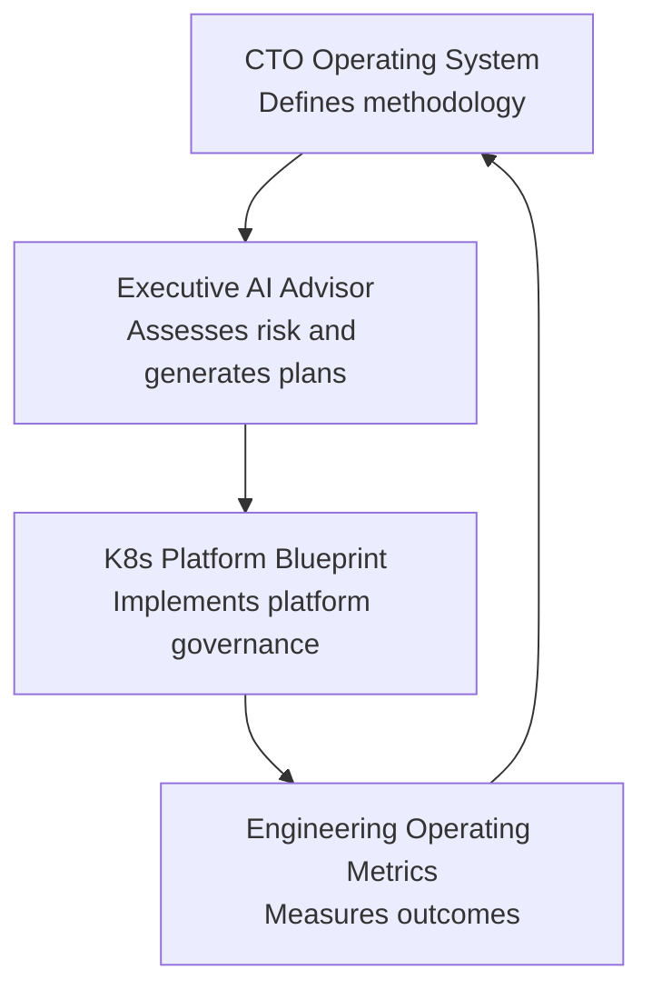

# Technology Leadership Portfolio

A practical system for assessing, operating, governing, and improving technology organizations.

## Executive Summary

This portfolio connects four repositories into one coherent CTO and operating partner narrative. Together they demonstrate a practical operating model for technology diligence, AI governance, platform modernization, Kubernetes governance, engineering operating metrics, 100-day planning, and board-level reporting.

The work is positioned as a technology leadership system, not a collection of disconnected tools. It shows how to assess risk, translate findings into executive language, create operating plans, implement governance patterns, and measure whether execution is improving.

## Operating Model

## Project Portfolio

### CTO Operating System

**What it does:** Defines the methodology, frameworks, playbooks, governance models, board reporting templates, diligence frameworks, and operating cadences for technology leadership.

**Who it is for:** CTOs, fractional CTOs, CEOs, founders, PE operating partners, boards, and technology leaders.

**Business value:** Creates a repeatable way to evaluate technology organizations, align technical decisions with business outcomes, and communicate tradeoffs clearly to executives and boards.

**Status:** Methodology and documentation repository.

**Example outputs:**

- 100-day CTO plan
- technology assessment framework
- AI governance framework
- board technology report template
- technology risk register

**Repository:** [cto-operating-system](https://github.com/serewicz/cto-operating-system)

### Executive AI Advisor

**What it does:** Analyzes company documents and generates diligence reports, board briefs, AI governance assessments, CRA readiness assessments, and 100-day technology plans.

**Who it is for:** CTOs, PE operating partners, diligence teams, boards, investors, and technology advisors.

**Business value:** Turns unstructured company evidence into cited executive outputs that support diligence, governance, planning, and board communication.

**Status:** Working local executive demo and portfolio-grade MVP.

**Example outputs:**

- Technology Due Diligence Report
- CRA Readiness Assessment
- AI Governance Assessment
- 100-Day Technology Plan
- Risk Heatmap
- Board Questions

**Repository:** [Executive-AI-Advisor](https://github.com/serewicz/Executive-AI-Advisor)

### K8s Platform Blueprint

**What it does:** Provides implementation patterns for Kubernetes governance, FinOps, observability, policy-as-code, compliance evidence, and platform operations.

**Who it is for:** CTOs, platform leaders, infrastructure teams, security leaders, operating partners, and technology diligence reviewers.

**Business value:** Shows how platform findings can be converted into practical controls for cost visibility, security governance, reliability, compliance evidence, and platform modernization.

**Status:** Executive-grade reference architecture and implementation blueprint.

**Example outputs:**

- platform governance maturity model
- FinOps and executive dashboard patterns
- diligence finding to control mapping
- AI infrastructure governance model
- policy-as-code examples

**Repository:** [k8s-platform-blueprint](https://github.com/serewicz/k8s-platform-blueprint)

### Engineering Operating Metrics

**What it does:** Measures engineering delivery flow, review quality, rework, cost, risk, AI usage, and governance.

**Who it is for:** CTOs, VP Engineering, engineering managers, operating partners, technology investors, and boards.

**Business value:** Helps leadership understand engineering effectiveness beyond activity metrics by connecting delivery, quality, cost, risk, and governance into one operating view.

**Status:** Lightweight Streamlit executive analytics prototype with demo and live GitHub modes.

**Example outputs:**

- executive engineering dashboard
- median cycle time
- review quality score
- rework rate
- engineering cost estimate
- AI usage cost
- technical risk score
- recommended actions

**Repository:** [engineering-operating-metrics](https://github.com/serewicz/engineering-operating-metrics)

## Case Studies

These synthetic case studies show how the four repositories work together as one technology leadership system. They do not include confidential client data.

### Case Study 1: Founder-Led SaaS Acquisition Target

**Problem:** Founder dependency, manual deployments, limited documentation, informal security ownership, and integration readiness risk.

**Uses:**

- Executive AI Advisor for diligence
- CTO Operating System for methodology
- K8s Platform Blueprint for remediation reference
- Engineering Operating Metrics for post-close measurement

**Outputs:**

- Technology Due Diligence Report
- 100-Day Acquisition Integration Plan
- Risk Heatmap
- Board Questions

**Read the case study:** [Founder-Led SaaS Acquisition Target](case-studies/founder-led-saas-acquisition-target.md)

### Case Study 2: Growth Equity B2B SaaS

**Problem:** Scaling pressure, cloud cost growth, delivery predictability, security governance, and AI readiness.

**Uses:**

- Executive AI Advisor for growth-equity diligence
- CTO Operating System for operating cadence
- K8s Platform Blueprint for FinOps and platform governance
- Engineering Operating Metrics for delivery metrics

**Outputs:**

- Board Technology Brief
- Growth Equity 100-Day Plan
- Cloud Cost Review
- Engineering Operating Dashboard

**Read the case study:** [Growth Equity B2B SaaS](case-studies/growth-equity-b2b-saas.md)

### Case Study 3: Regulated FinTech Platform

**Problem:** Compliance readiness, vendor concentration, privileged access, incident reporting, CRA readiness, and AI governance.

**Uses:**

- Executive AI Advisor for CRA readiness and AI governance
- CTO Operating System for board reporting and governance templates
- K8s Platform Blueprint for policy-as-code and compliance evidence
- Engineering Operating Metrics for review quality and risk controls

**Outputs:**

- CRA Readiness Assessment
- AI Governance Assessment
- Security Risk Summary
- Board Discussion Points

**Read the case study:** [Regulated FinTech Platform](case-studies/regulated-fintech-platform.md)

## Why This Matters

Most technology failures in growing companies are not isolated engineering failures. They are failures of visibility, governance, prioritization, and execution.

This portfolio demonstrates:

- how to assess technology risk
- how to translate risk into board-level language
- how to create operating plans
- how to implement governance patterns
- how to measure whether execution is improving

The core idea is simple: technology leadership improves when ownership, tradeoffs, risks, controls, and outcomes are explicit.

## Relevant For

- CTO roles
- interim and fractional CTO work
- PE operating partner support
- board advisory work
- technology due diligence
- AI governance and risk reviews
- platform modernization programs

## Calls to Action

- View GitHub repositories:
  - [CTO Operating System](https://github.com/serewicz/cto-operating-system)
  - [Executive AI Advisor](https://github.com/serewicz/Executive-AI-Advisor)
  - [K8s Platform Blueprint](https://github.com/serewicz/k8s-platform-blueprint)
  - [Engineering Operating Metrics](https://github.com/serewicz/engineering-operating-metrics)
- Read case studies:
  - [Founder-Led SaaS Acquisition Target](case-studies/founder-led-saas-acquisition-target.md)
  - [Growth Equity B2B SaaS](case-studies/growth-equity-b2b-saas.md)
  - [Regulated FinTech Platform](case-studies/regulated-fintech-platform.md)
- Review Executive AI Advisor demo: [Executive-AI-Advisor](https://github.com/serewicz/Executive-AI-Advisor)
- Contact / LinkedIn: `https://www.linkedin.com/in/serewicz`
- Website: placeholder
